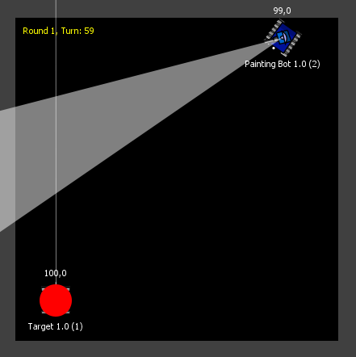

# Debugging

Here follows some information about [print debugging] your bot using print statements or a logging framework.

## Run your bot from the command line

One easy way to debug your bot is to run it from the command line and put some print statements into your code to write
out debugging information into the command line via stdin and/or stderr. With Java/JVM, you will typically use
[System.out.println()], [SLF4J] or [Log4j], and for .Net you'll typically use [Console.WriteLine()] or use [Logging].

To see how a bot is started up you can have a look at the sample bots and examine the script files. How your robot is
started depends on the programming language and platform you are using. But here follows some examples of what to write
in the command line or script file.

#### Java:

```shell
java -cp ../lib/* MyFirstBot.java
```

Here `../lib/*` assumes the `robocode-tankroyale-bot-api-x.y.z.jar` is located in the `lib` directory.

#### .Net

```shell
dotnet run
```

This assumes you have your project file in the directory where you run the `dotnet` command.

## Supply a server secret

The first time the server is running a battle, it creates a random secret (key) that all bots must supply to join the
battle. The GUI handles this automatically in the background when starting up bots from the GUI via the booter.

The secret protects your server against external bots trying to join without (your) permission. They will need the
secret from your server to join it.

So to run your bot from the command line, you'll need to provide the secret for the server. The easiest way to do this
is to set/export the `SERVER_SECRET` environment variable which the Bot API will read and send to the server (
via the bot handshake).

You'll find the generated secret for your server with the `server.properties` file in the same directory as the GUI
application is run from. Copy and paste the value after the equal-sign (=) from the `bots-secrets` field and use it for
defining the value of your `SERVER_SECRET` variable, e.g.:

#### Bash:

```bash
export SERVER_SECRET=s0m3R0bOc0dEs3crEt
```

#### Windows command prompt:

```shell
set SERVER_SECRET=s0m3R0bOc0dEs3crEt
```

You can put this into a script used for running your bot.

## How to join a new battle

**Step 1: Start server or new battle**

First, you need to start a server as your bot needs to join a server. You can do this from the GUI menu by starting a
server or a battle. When starting a new battle from the GUI, a server will automatically be started as well.

**Step 2: Start your bot from the command line**

Now you need to start your bot from the command line as described earlier.

**Step 3: Wait for your bot to show up in 'Joined Bots'**

On the dialog for selecting bots for the battle, you should see your bot show up under the 'Joined Bots' list. Add it to
the battle and add some other opponent bot(s) as well to start the battle.

**Step 4: Observe output in the command line**

Your print or logging information should be written out to the command line. If not, make sure to put the logging
information in the constructor or main method to make sure something is written out.

## Graphical Debugging

Robocode features a Graphical Debugging tool that allows bots to draw objects on the battlefield. This is particularly
useful for visualizing scanned bot positions, enemy movement patterns, and virtual bullets. For instance, you can
determine if a virtual bullet would have hit an enemy if it were real, which helps in refining your targeting strategy.

For drawing objects in Robocode, the methods differ depending on the Bot API variant you're using:

- Java: Use the `getGraphics()` method, which returns a `java.awt.Graphics2D` instance for painting objects.
- .Net: Use the `Graphics` property, which provides a `System.Drawing.Graphics` compatible instance for drawing.

The sample bot, **PaintingBot**, showcases how to effectively use debugging graphics. Every tick, it paints a red circle
at the most recent location where it scanned another bot.



**Note:** Graphics are not painted immediately, but rather in the next turn. This delay occurs because:

1. The graphics must first be serialized as SVG and sent to the server.
2. The server then forwards the graphics to all observers (like the UI).
3. Finally, the UI paints the graphics on the battlefield.


[print debugging]: https://en.wikipedia.org/wiki/Debugging "Print debugging"

[System.out.println()]: https://www.geeksforgeeks.org/system-out-println-in-java/ "Print debugging in Java"

[Console.WriteLine()]: https://docs.microsoft.com/en-us/dotnet/api/system.console.writeline?view=net-6.0 "Print debugging in .Net"

[SLF4J]: https://www.slf4j.org/ "Simple Logging Facade for Java (SLF4J)"

[Log4j]: https://logging.apache.org/log4j/2.x/ "Apache Log4j 2"

[Logging]: https://docs.microsoft.com/en-us/dotnet/core/extensions/logging?tabs=command-line
